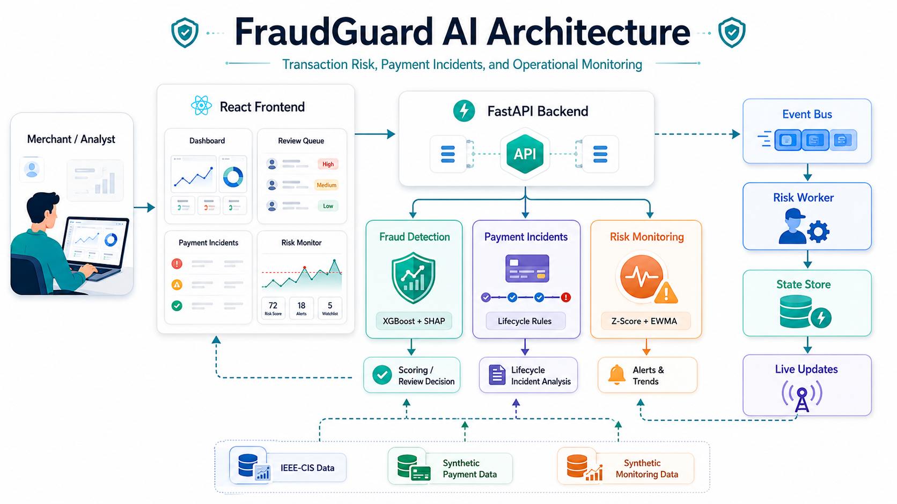

# FraudGuard AI

**AI-powered fraud-risk decision support for merchant payments**

## Live Demo

[Open FraudGuard AI](https://frontend-arpit-negi99s-projects.vercel.app)

FraudGuard AI helps merchants identify risky transactions before they turn into fraud losses, chargebacks, refund disputes, or unnecessary manual-review cost. It scores each transaction with a frozen machine-learning model, applies a locked review threshold, and gives the risk team a clear `ALLOW` or `REVIEW` recommendation.

The system is strictly defense-only. It does not generate fraud tactics, bypass controls, auto-block payments, issue refunds, or connect to real payment-provider infrastructure.

## Why This Matters

Merchants lose money in two directions:

- fraudulent transactions that are approved,
- legitimate customers who are slowed down by unnecessary reviews.

FraudGuard AI is built around that tradeoff. It reports standard fraud metrics and business-facing cost signals so a risk manager can understand both fraud capture and false-positive burden.

## What The Product Does

- Scores individual transactions using a frozen XGBoost fraud-risk model.
- Converts the risk score into `ALLOW` or `REVIEW` using threshold `0.60`.
- Shows SHAP-based model contributors for transaction review.
- Supports batch scoring for CSV transaction files.
- Provides a review queue sorted by highest risk.
- Shows payment lifecycle incident signals using deterministic defensive rules.
- Monitors operational risk spikes using rolling statistical windows.
- Supports an optional local streaming demo with Redpanda, Redis, and Server-Sent Events.

## AI/ML Approach

The core detector is a supervised tabular fraud model trained on the IEEE-CIS Fraud Detection dataset.

```text
Transaction
    -> Frozen preprocessing
    -> XGBoost fraud-risk model
    -> Risk score
    -> Threshold 0.60
    -> ALLOW / REVIEW
    -> SHAP explanation
```

The frontend does not calculate fraud decisions. React sends transaction inputs to the FastAPI backend, and the backend uses the saved preprocessing and model artifacts.

## Measured Held-Out Results

The final chronological held-out test split was evaluated only after model and threshold selection.

| Metric | Value |
| --- | ---: |
| Precision | 0.364018 |
| Recall | 0.563088 |
| F1 | 0.442180 |
| PR-AUC | 0.514931 |
| ROC-AUC | 0.891247 |
| Review rate | 0.053838 |

Threshold `0.60` was selected from validation analysis before final test evaluation. It remains frozen for the demo.

## Cost-Aware Decisioning

The project evaluates more than model accuracy. It tracks:

- false positives,
- missed fraud cases,
- review workload,
- modeled false-positive cost,
- modeled missed-fraud cost.

Cost values are scenario estimates, not claimed merchant savings.

## Application Architecture



The diagram shows how a merchant or analyst interacts with the React console, which calls the FastAPI backend for all risk decisions. The backend keeps the fraud model, payment incident logic, and operational monitoring separate, while optional streaming infrastructure can publish scored events to a worker and state store for live risk updates.

```text
React + Vite frontend
    |
FastAPI backend
    |
Frozen XGBoost inference pipeline
    |
Risk score + ALLOW/REVIEW + explanation
```

Optional streaming architecture:

```text
FastAPI prediction event
    -> bounded async queue
    -> Redpanda topic
    -> analytics worker
    -> Redis merchant risk state
    -> SSE live updates
    -> Risk Monitor UI
```

Local mode is the default and does not require Redpanda or Redis.

## Repository Structure

```text
backend/              FastAPI app and service layer
frontend/             React + Vite client
src/                  data, inference, models, evaluation, monitoring logic
scripts/              reproducible pipeline and demo scripts
artifacts/            frozen model, preprocessor, results, demo rows
configs/              project configuration
documentation/        architecture, evaluation, and project notes
tests/                Python regression tests
```

## Requirements

No external API keys are required for normal runtime.

Core runtime uses local artifacts:

- `artifacts/models/xgboost_model.json`
- `artifacts/preprocessors/preprocessor.joblib`
- `artifacts/preprocessors/preprocessing_metadata.json`
- `artifacts/demo/demo_transactions.csv`
- `artifacts/demo/demo_labels.csv`

Raw IEEE-CIS CSV files are not required to launch the demo.

## Run Locally

From the repository root:

```powershell
cd D:\fraudguard-ai
.\.venv\Scripts\Activate.ps1
python -m uvicorn backend.api:app --reload --port 8000
```

In a second terminal:

```powershell
cd D:\fraudguard-ai\frontend
npm install
npm run dev
```

Open:

```text
http://localhost:5173
```

Backend health check:

```text
http://localhost:8000/health
```

## Deploy

Recommended hackathon deployment:

```text
Backend: Render
Frontend: Vercel
Streaming mode: local
External API keys: none
```

Current frontend deployment:

```text
https://frontend-arpit-negi99s-projects.vercel.app
```

### Backend On Render

Create a new Render Blueprint or Web Service from this repository.

If using the included `render.yaml`, Render can read:

```text
Build Command: pip install -r requirements.txt
Start Command: python -m uvicorn backend.api:app --host 0.0.0.0 --port $PORT
```

Environment:

```text
RISK_STREAM_MODE=local
CORS_ALLOWED_ORIGINS=*
```

After deploy, verify:

```text
https://your-render-service.onrender.com/health
```

### Frontend On Vercel

Create a Vercel project with:

```text
Root Directory: frontend
Build Command: npm run build
Output Directory: dist
Install Command: npm install
```

Set this frontend environment variable to your Render backend URL:

```text
VITE_API_BASE_URL=https://your-render-service.onrender.com
```

Redeploy the frontend after setting the environment variable.

## Score A New Transaction

Open the **Transactions** page and use **Score New Transaction**.

The form submits to:

```text
POST /predict
```

The result shown in the UI is produced by the backend model pipeline. If the manually entered row does not include every IEEE-CIS feature, the backend fills absent model features as missing values and reports that in technical warnings.

## Optional Streaming Demo

Streaming is optional. Start with normal local mode unless you specifically want live risk-monitor updates.

```powershell
docker compose -f docker-compose.streaming.yml up -d
```

Run the backend in stream mode:

```powershell
$env:RISK_STREAM_MODE="stream"
python -m uvicorn backend.api:app --reload --port 8000
```

Run the analytics worker:

```powershell
$env:RISK_STREAM_MODE="stream"
python workers/risk_analytics_worker.py
```

Replay demo events:

```powershell
python scripts/replay_stream_demo.py --scenario mixed_spike --events-per-second 5 --count 100
```

The Risk Monitor can then receive updates through:

```text
GET /monitoring/stream
```

## Key API Endpoints

- `GET /health`
- `GET /demo/transactions`
- `GET /demo/transactions/{transaction_id}`
- `POST /predict`
- `POST /predict/batch`
- `GET /risk/review-queue`
- `GET /policy/presets`
- `POST /policy/simulate`
- `GET /evaluation/final`
- `GET /incidents/lifecycles`
- `GET /incidents/lifecycles/{payment_id}`
- `GET /monitoring/current`
- `GET /monitoring/stream`
- `GET /monitoring/scenarios`

## Tests

Python:

```powershell
python -m pip check
python -m pytest -q
```

Frontend:

```powershell
cd frontend
npm test
npm run build
```

## Demo Flow

1. Start the FastAPI backend and React frontend.
2. Open the Dashboard to show overall risk workload.
3. Go to Transactions and score a new transaction.
4. Open a high-risk transaction and show the SHAP contributors.
5. Use Review Queue to show how risky transactions are prioritized.
6. Open Policy to explain the frozen threshold and what-if cost analysis.
7. Open Risk Monitor to show rolling operational risk signals.

See [documentation/DEMO-FLOW.md](documentation/DEMO-FLOW.md) for the full walkthrough.

## Dataset And Safety Notes

The training dataset is IEEE-CIS Fraud Detection. Raw files under `data/raw/` are ignored by Git and should not be committed.

The dataset is historical and anonymized. It is suitable for an MVP benchmark, not a guarantee of production performance on a specific merchant or region.

## Limitations

- Fraud scores are risk scores, not calibrated real-world probabilities.
- The held-out recall at threshold `0.60` is `0.563088`.
- Cost analysis uses assumptions, not real merchant accounting data.
- Payment lifecycle and monitoring data are synthetic/demo data.
- The system recommends `ALLOW` or `REVIEW`; it does not auto-block payments.
- There is no real Razorpay, bank, webhook, refund, or chargeback integration.
- No LLM, RAG, embeddings, or external model API is used.

## Project Documentation

- [Frozen System](documentation/FROZEN-SYSTEM.md)
- [AI/ML Architecture](documentation/AI-ML-Architecture.md)
- [Evaluation](documentation/ML-Evaluation.md)
- [Streaming Architecture](documentation/Streaming-Architecture.md)
- [Demo Flow](documentation/DEMO-FLOW.md)
