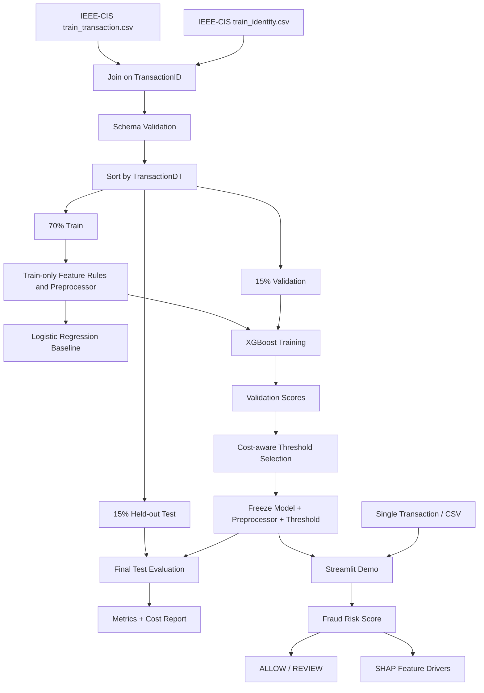

# AI/ML Architecture — FraudGuard AI

## 1. Architecture Goal

Build one reproducible fraud-risk pipeline that uses the **same preprocessing contract** during training, evaluation, and demo inference.

The architecture deliberately avoids LLMs, RAG, vector databases, microservices, and heavyweight model-serving infrastructure.

Current client architecture: React + Vite frontend with a lightweight FastAPI backend that imports the frozen `FraudPredictor`.

---

# 2. High-Level Pipeline

```text
IEEE-CIS labeled training files
        ↓
Join transaction + identity tables
        ↓
Schema checks + deterministic cleaning
        ↓
Chronological split using TransactionDT
        ↓
Train-only feature selection + preprocessing fit
        ↓
Baseline Logistic Regression
        ↓
XGBoost training + early stopping
        ↓
Validation scoring
        ↓
Cost-aware threshold selection
        ↓
Freeze model + preprocessor + threshold + metadata
        ↓
Untouched temporal test evaluation
        ↓
Streamlit demo / batch scorer
        ↓
Risk score + ALLOW/REVIEW + SHAP drivers
```

---

# 3. Data Pipeline

## 3.1 Data source

Use the labeled **IEEE-CIS Fraud Detection** training data:

- `train_transaction.csv`
- `train_identity.csv`

Join using `TransactionID` with a left join from transactions to identity because not every transaction has a corresponding identity row.

Do not use the competition test set to report final precision/recall because its target labels are not available to us.

## 3.2 Collection

Development setup may download data with Kaggle tooling. Raw competition data must remain outside version control and must not be bundled into the deployed app.

## 3.3 Schema validation

Before any training:

- verify `TransactionID` exists and is unique in the transaction table,
- verify `isFraud` is binary,
- verify `TransactionDT` exists,
- verify the join does not increase the transaction row count unexpectedly,
- record row count, class count, and column count,
- fail loudly if required columns are absent.

## 3.4 Cleaning

Training-only rules:

1. Remove identifier columns from model input (`TransactionID`).
2. Keep `TransactionDT` for ordering/splitting; do not use absolute elapsed time as a raw model feature in P0.
3. Determine high-missingness columns using the **training partition only**.
4. Initial drop threshold: columns with more than 95% missing in the training partition.
5. Keep numeric missing values as `NaN` where supported by XGBoost.
6. Encode categorical values using a train-fitted encoder with a stable unknown-category value.
7. Do not perform target encoding in P0.
8. Do not use SMOTE in P0.

## 3.5 Deduplication

- `TransactionID` is expected to be unique.
- If duplicate IDs are found, stop preprocessing and investigate rather than silently dropping duplicates.
- Do not deduplicate rows based only on feature similarity because two genuine transactions can share feature values.

## 3.6 Feature engineering — P0

Keep feature engineering intentionally small and deterministic:

- `log_transaction_amount = log1p(TransactionAmt)`
- purchaser/recipient email-domain match indicator when both fields exist,
- count of missing identity fields for the transaction,
- count of missing selected transaction fields.

Do not add dozens of handcrafted heuristics before establishing a reliable baseline.

## 3.7 Feature engineering — P1 only

If Day 6 error analysis shows a clear gap, add at most one iteration of past-only behavioral features, for example previous transaction count or previous amount aggregate for a stable entity proxy. Such features must be computed sequentially from prior records only. No future transaction may influence an earlier transaction’s feature.

## 3.8 Data split

Sort labeled data by `TransactionDT` and create contiguous splits:

- first 70%: train,
- next 15%: validation,
- final 15%: held-out test.

Why chronological instead of random?

Fraud behavior and transaction distributions drift. A chronological holdout is more realistic and reduces the risk of optimistic random-split results caused by near-duplicate temporal patterns.

## 3.9 Leakage prevention

The following must use **train only**:

- high-missingness decisions,
- categorical vocabulary/encoding,
- imputers if introduced,
- feature selection,
- class weighting,
- model training.

The following may use **validation but never test**:

- hyperparameter decisions,
- early stopping,
- threshold selection,
- cost-scenario threshold optimization.

The test set is touched once the model/threshold are frozen for final reporting.

---

# 4. Model Pipeline

## 4.1 Baseline model

### Majority-class baseline

Predict non-fraud for every transaction. This demonstrates why accuracy is a misleading metric for imbalanced fraud data.

### Logistic Regression baseline

Use a compact, train-fitted feature pipeline. The baseline exists to answer: “Does nonlinear gradient boosting provide material value over a simple supervised classifier?”

## 4.2 Primary model

**XGBoost binary classifier**.

Recommended starting configuration principles:

- binary logistic objective,
- histogram tree method on CPU,
- PR-AUC/AUC-PR as an early-stopping/evaluation signal,
- moderate tree depth,
- learning-rate + early-stopping rather than a huge tree count,
- class weight derived from the training split only,
- fixed random seed.

Do not spend more than one focused tuning cycle before the first complete evaluation.

## 4.3 Input format

The model receives a numeric matrix produced by the frozen preprocessing pipeline.

The user/demo layer deals only with named raw fields; it never manually reproduces encoding logic.

## 4.4 Output format

Raw model inference produces a score `s ∈ [0,1]`.

Until calibration is added and validated, the product UI calls this a **fraud risk score**, not a guaranteed real-world probability.

## 4.5 Inference decision

```text
if risk_score >= locked_review_threshold:
    decision = REVIEW
else:
    decision = ALLOW
```

The MVP never returns “BLOCK.”

---

# 5. Cost-Aware Threshold Pipeline

## 5.1 Why threshold tuning matters

A default 0.5 threshold is arbitrary for a rare-event fraud problem. The cost of a false negative and a false positive are not equal.

## 5.2 Reference cost function

For threshold `t` on validation data:

```text
missed_fraud_loss = Σ amount_i × fraud_loss_rate
                    for y_i=1 and score_i<t

false_positive_cost = Σ [review_cost
                         + amount_i × friction_rate]
                      for y_i=0 and score_i>=t

total_cost = missed_fraud_loss + false_positive_cost
```

All currency/cost parameters are scenario assumptions and must be shown explicitly.

## 5.3 Threshold selection

1. Score the validation split.
2. Evaluate candidate thresholds.
3. Record precision, recall, F1, FPR, flagged fraction, and cost.
4. Select the default threshold that minimizes reference scenario cost.
5. Save the threshold and cost assumptions in model metadata.
6. Freeze them before test evaluation.

Also compute an F1-optimal validation threshold for analysis, but do not silently switch thresholds after seeing test metrics.

---

# 6. Explainability Pipeline

For one transaction:

```text
raw row
  ↓
frozen preprocessing
  ↓
XGBoost score
  ↓
SHAP TreeExplainer
  ↓
top absolute feature contributions
  ↓
user-facing signal summary
```

Display:

- top risk-raising features,
- top risk-lowering features,
- feature value where meaningful,
- model score and threshold.

Do not claim that SHAP proves causality.

Do not generate hidden reasoning or chain-of-thought.

---

# 7. LLM Pipeline

**Not applicable to the MVP.**

No LLM is needed for classification, explanation, thresholding, or evaluation.

Therefore:

- no system prompt,
- no user prompt,
- no LLM context,
- no LLM tool calls,
- no model API key,
- no hallucination-prone generated fraud decision.

If a later product version adds narrative summaries, they must consume deterministic model outputs and may never alter the fraud decision.

---

# 8. RAG Pipeline

**Not applicable.**

The task does not require retrieval from a document corpus. Adding chunking, embeddings, vector storage, or retrieval would increase complexity without improving the core detector.

---

# 9. Model Artifacts

The implemented repository should eventually save these versioned artifacts:

- trained XGBoost model,
- fitted preprocessing pipeline,
- selected feature list,
- review threshold,
- cost assumptions,
- model configuration,
- dataset/split metadata,
- evaluation JSON,
- model version/hash.

The test set itself is not packaged into the deployed app.

---

# 10. Model Serving

## MVP serving choice

Use a lightweight **FastAPI** application that imports the frozen inference pipeline in-process.

The React frontend is the primary client-facing submission UI. Streamlit may remain available only as a fallback/debug interface.

### Why

- keeps the Python ML pipeline as the source of truth,
- provides a polished client-facing UI without reimplementing inference in JavaScript,
- supports single and batch demo use from small packaged artifacts,
- keeps deployment lightweight.

---

# 11. Failure Handling

## Model artifact missing/corrupt

- Fail application startup with a clear message.
- Do not fall back to fabricated/random predictions.

## Invalid input

- Validate required fields and types.
- Show row-level batch errors.
- Do not silently coerce impossible values.

## Unknown categorical value

- Map through the train-fitted “unknown” encoding path.
- Do not retrain dynamically.

## Excessive missingness

- Score only if the row satisfies a minimum schema completeness rule.
- Otherwise return “insufficient input for reliable scoring.”

## Low-confidence/borderline score

- Show that the score is near the threshold.
- Recommend manual review rather than overstate certainty.

## SHAP explanation failure

- Still return the model score and review decision.
- Show “explanation unavailable” with a logged error.

## API failure

Core inference has no external API dependency. This failure mode is therefore eliminated from P0.

## No relevant information found

Not applicable because there is no retrieval system.

## Invalid generated output / hallucination

Not applicable because no LLM is in the decision pipeline.

---

# 12. Architecture Diagram


