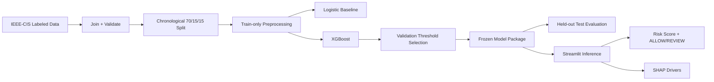

# FraudGuard AI

**Cost-aware online transaction fraud scoring for merchants**

> Status: final held-out evaluation complete; ready for deployment hardening and presentation preparation.

## Project

FraudGuard AI

---

## Problem Statement

Merchants lose money when fraudulent online transactions are approved, but overly aggressive fraud controls also hurt legitimate customers and create manual-review cost.

FraudGuard AI is a defense-only fraud-risk scorer that ranks transactions by fraud risk, flags higher-risk transactions for manual review, and reports both fraud-detection metrics and false-positive cost.

Short version: merchant transaction fraud risk management.

---

## Solution

The MVP will provide:

- a fraud risk score for a single transaction,
- `ALLOW` / `REVIEW` decision using a validation-selected threshold,
- top SHAP feature drivers,
- batch CSV scoring,
- held-out evaluation,
- explicit false-positive and missed-fraud cost analysis.

The MVP will **not** automatically block transactions.

### Differentiator

FraudGuard is not just fraud prediction:

- cost-aware policy analysis,
- review-capacity thresholding,
- SHAP explainability,
- human-in-the-loop `ALLOW` / `REVIEW` decisioning.

---

## AI/ML Approach

### Primary model

XGBoost binary classifier for imbalanced tabular fraud detection.

### Baselines

- majority-class sanity baseline,
- logistic regression supervised baseline.

### Why this approach

Gradient-boosted trees are a strong fit for mixed, sparse, nonlinear tabular fraud features and can be explained efficiently with SHAP. A deep neural network, LLM, RAG system, or vector database is not justified for the 10-day MVP.

---

## Architecture



See `AI-ML-Architecture.md` for the full design.

---

## Dataset

Dataset: **IEEE-CIS Fraud Detection**.

Use labeled training files:

- `train_transaction.csv`
- `train_identity.csv`

The raw dataset is not stored in Git.

Public dataset page:

https://www.kaggle.com/c/ieee-fraud-detection/data

### Important limitation

This dataset is not India-specific. Results will be presented as benchmark/MVP results, not as evidence of production performance on Indian payment traffic.

---

## Model

Primary model: XGBoost.

Implemented principles:

- class weighting from train split only,
- histogram CPU training,
- early stopping on validation data,
- fixed random seed,
- validation-only threshold selection.

Frozen model artifact: `artifacts/models/xgboost_model.json`.

Frozen preprocessing artifact: `artifacts/preprocessors/preprocessor.joblib`.

Frozen operating threshold: `0.60`, selected on validation data before the held-out test split was opened.

---

## Training / Fine-Tuning Strategy

- Train tabular classifier from the labeled IEEE-CIS data: **Yes**.
- Train a large model from scratch: **No**.
- Transfer learning: **No**.
- Fine-tune an LLM: **No**.
- Prompt engineering: **No core dependency**.
- RAG: **No**.
- Embeddings: **No**.
- External inference API: **No**.

---

## Inference Pipeline

```text
raw transaction
    ↓
schema validation
    ↓
frozen preprocessing
    ↓
XGBoost risk score
    ↓
locked cost-aware threshold
    ↓
ALLOW / REVIEW
    ↓
SHAP feature attribution
```

---

## Evaluation Methodology

Chronological split by `TransactionDT`:

- 70% train,
- 15% validation,
- 15% held-out test.

Primary metrics:

- Precision,
- Recall,
- F1,
- PR-AUC.

Supporting metrics:

- ROC-AUC,
- false-positive rate,
- confusion matrix,
- review rate.

Business metrics:

- missed-fraud transaction value,
- modeled false-positive review/friction cost,
- total scenario cost.

Threshold is selected using validation data only.

---

## Results

The operating threshold was selected on validation data before the held-out test was opened.

### Validation at Threshold 0.60

- Precision: `0.430783`
- Recall: `0.612755`
- F1: `0.505903`
- PR-AUC: `0.571018`
- ROC-AUC: `0.918641`
- Review rate: `0.048848`

### Held-Out Test at Frozen Threshold 0.60

- Rows: `88581`
- Precision: `0.364018`
- Recall: `0.563088`
- F1: `0.442180`
- PR-AUC: `0.514931`
- ROC-AUC: `0.891247`
- Accuracy: `0.950554`
- True positives: `1736`
- False positives: `3033`
- True negatives: `82465`
- False negatives: `1347`
- Review rate: `0.053838`

### Baselines on Held-Out Test

- Majority legitimate baseline: accuracy `0.965196`, precision `0.000000`, recall `0.000000`, F1 `0.000000`.
- Logistic Regression at frozen threshold 0.50: precision `0.120339`, recall `0.699319`, F1 `0.205343`, PR-AUC `0.167960`, ROC-AUC `0.822114`, review rate `0.202256`.

### Held-Out Modeled Cost Simulation

Cost values are scenario cost units, not actual merchant savings.

- Low review cost total at threshold 0.60: `219653.97`
- Medium review cost total at threshold 0.60: `231785.97`
- High review cost total at threshold 0.60: `246950.97`

---

## Minimum Tech Stack

### Language

Python.

### Data

- pandas,
- NumPy.

### ML

- scikit-learn for preprocessing, metrics, and logistic-regression baseline,
- XGBoost for primary fraud classifier,
- SHAP for explanation.

### UI

Streamlit.

### Experiment tracking

Simple versioned JSON/CSV/Markdown experiment artifacts in the repository. No MLflow server is required for the MVP.

### Vector database

None.

### Deployment

Streamlit Community Cloud or equivalent lightweight Python hosting.

---

## Installation

Setup:

```bash
python -m venv .venv
python -m pip install -r requirements.txt
```

On Windows PowerShell:

```powershell
.\.venv\Scripts\Activate.ps1
```

On macOS/Linux:

```bash
source .venv/bin/activate
```

Runtime dependencies are pinned through `requirements-lock.txt`.

---

## Environment Variables

Expected core inference variables: **none**.

No API keys or external model services are required.

Development-only dataset download may use:

```text
KAGGLE_USERNAME
KAGGLE_KEY
```

Never commit credentials.

---

## Running the Project

Core commands:

```bash
# Prepare data
python scripts/prepare_data.py

# Train baseline and primary model
python scripts/train_baseline.py
python scripts/train_xgboost.py

# Validation analyses
python scripts/analyze_thresholds.py
python scripts/analyze_costs.py
python scripts/generate_explanations.py

# Official final held-out evaluation
python scripts/evaluate_final_test.py

# Launch demo
python -m streamlit run app.py
```

The deployed demo uses frozen artifacts and small packaged demo CSVs under `artifacts/demo/`. Raw IEEE-CIS training CSVs are not required for normal inference startup.

## Testing

```bash
python -m pytest -v
python scripts/demo_inference.py
```

## Demo

- Transaction Inspector: inspect packaged historical demo transactions and SHAP contributors.
- Batch Analysis: score a small CSV-style batch and download scored results.
- Risk Policy Lab: explore validation-derived threshold tradeoffs without changing the frozen final policy.

---

## Running Evaluation

Final evaluation must:

1. load the frozen model/preprocessor/threshold,
2. load only the held-out chronological test split,
3. compute metrics from predictions,
4. save machine-readable evaluation artifacts,
5. never retune the model or threshold.

---

## Deployment

Planned deployment process:

1. train/freeze model locally or in a controlled notebook/runtime,
2. store compact model artifacts,
3. exclude raw competition data,
4. deploy Streamlit app,
5. run single-row and batch smoke tests,
6. verify displayed metrics match stored evaluation artifacts.

---

## Limitations

- Public benchmark data is not merchant-specific.
- Dataset is not India-specific.
- Many features are anonymized.
- Fraud prevalence may differ from real merchants.
- Cost assumptions are scenarios, not observed merchant economics.
- Current model recall on the held-out test is 56.3%.
- The risk score is not guaranteed calibrated probability.
- The system is decision support, not an automatic payment-decline engine.
- Current fraud behavior can drift beyond the historical dataset.

---

## Future Improvements

Only after the MVP is complete:

- merchant-specific retraining,
- probability calibration,
- past-only behavioral velocity features,
- drift monitoring,
- human-feedback analysis,
- production API integration,
- graph/ring analysis as a separate project scope.

Do not add these before P0 is stable.
