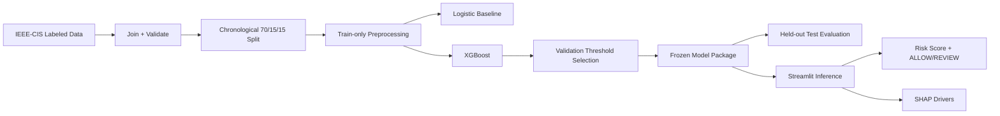

# FraudGuard AI

**Cost-aware online transaction fraud scoring for merchants**

> Status: specification complete; implementation not started yet.

---

## Problem Statement

Merchants lose money when fraudulent online transactions are approved, but overly aggressive fraud controls also hurt legitimate customers and create manual-review cost.

FraudGuard AI is a defense-only fraud-risk scorer that ranks transactions by fraud risk, flags higher-risk transactions for manual review, and reports both fraud-detection metrics and false-positive cost.

---

## Solution

The MVP will provide:

- a fraud risk score for a single transaction,
- `ALLOW` / `REVIEW` decision using a validation-selected threshold,
- top SHAP feature drivers,
- batch CSV scoring,
- held-out evaluation,
- explicit false-positive and missed-fraud cost analysis.

The MVP will **not** automatically block transactions.

---

## AI/ML Approach

### Primary model

XGBoost binary classifier for imbalanced tabular fraud detection.

### Baselines

- majority-class sanity baseline,
- logistic regression supervised baseline.

### Why this approach

Gradient-boosted trees are a strong fit for mixed, sparse, nonlinear tabular fraud features and can be explained efficiently with SHAP. A deep neural network, LLM, RAG system, or vector database is not justified for the 10-day MVP.

---

## Architecture



See `AI-ML-Architecture.md` for the full design.

---

## Dataset

Planned dataset: **IEEE-CIS Fraud Detection**.

Use labeled training files:

- `train_transaction.csv`
- `train_identity.csv`

The raw dataset is not stored in this repository.

Public dataset page:

https://www.kaggle.com/c/ieee-fraud-detection/data

### Important limitation

This dataset is not India-specific. Results will be presented as benchmark/MVP results, not as evidence of production performance on Indian payment traffic.

---

## Model

Planned primary model: XGBoost.

Planned principles:

- class weighting from train split only,
- histogram CPU training,
- early stopping on validation data,
- fixed random seed,
- validation-only threshold selection.

Exact hyperparameters will be recorded after experiments.

---

## Training / Fine-Tuning Strategy

- Train tabular classifier from the labeled IEEE-CIS data: **Yes**.
- Train a large model from scratch: **No**.
- Transfer learning: **No**.
- Fine-tune an LLM: **No**.
- Prompt engineering: **No core dependency**.
- RAG: **No**.
- Embeddings: **No**.
- External inference API: **No**.

---

## Inference Pipeline

```text
raw transaction
    ↓
schema validation
    ↓
frozen preprocessing
    ↓
XGBoost risk score
    ↓
locked cost-aware threshold
    ↓
ALLOW / REVIEW
    ↓
SHAP feature attribution
```

---

## Evaluation Methodology

Chronological split by `TransactionDT`:

- 70% train,
- 15% validation,
- 15% held-out test.

Primary metrics:

- Precision,
- Recall,
- F1,
- PR-AUC.

Supporting metrics:

- ROC-AUC,
- false-positive rate,
- confusion matrix,
- review rate.

Business metrics:

- missed-fraud transaction value,
- modeled false-positive review/friction cost,
- total scenario cost.

Threshold is selected using validation data only.

---

## Results

Implementation has not started. Do not add benchmark numbers here until they are produced by the final evaluation pipeline.

- Precision: `TODO: add after held-out evaluation`
- Recall: `TODO: add after held-out evaluation`
- F1: `TODO: add after held-out evaluation`
- PR-AUC: `TODO: add after held-out evaluation`
- ROC-AUC: `TODO: add after held-out evaluation`
- False-positive rate: `TODO: add after held-out evaluation`
- Reference-scenario cost: `TODO: add after held-out evaluation`
- Logistic-baseline comparison: `TODO: add after held-out evaluation`

---

## Minimum Tech Stack

### Language

Python.

### Data

- pandas,
- NumPy.

### ML

- scikit-learn for preprocessing, metrics, and logistic-regression baseline,
- XGBoost for primary fraud classifier,
- SHAP for explanation.

### UI

Streamlit.

### Experiment tracking

Simple versioned JSON/CSV/Markdown experiment artifacts in the repository. No MLflow server is required for the MVP.

### Vector database

None.

### Deployment

Streamlit Community Cloud or equivalent lightweight Python hosting.

---

## Installation

Implementation has not started. Planned setup:

```bash
python -m venv .venv
# activate environment
pip install -r requirements.txt
```

`requirements.txt` will be created during implementation and pinned before final deployment.

---

## Environment Variables

Expected core inference variables: **none**.

Development-only dataset download may use:

```text
KAGGLE_USERNAME
KAGGLE_KEY
```

Never commit credentials.

---

## Running the Project

Planned commands after implementation:

```bash
# Prepare data
python -m src.data.prepare

# Train baseline and primary model
python -m src.training.train

# Run held-out evaluation
python -m src.evaluation.evaluate

# Launch demo
streamlit run app.py
```

Command names are part of the planned interface and may be adjusted once implementation begins; update this README if they change.

---

## Running Evaluation

Final evaluation must:

1. load the frozen model/preprocessor/threshold,
2. load only the held-out chronological test split,
3. compute metrics from predictions,
4. save machine-readable evaluation artifacts,
5. never retune the model or threshold.

---

## Deployment

Planned deployment process:

1. train/freeze model locally or in a controlled notebook/runtime,
2. store compact model artifacts,
3. exclude raw competition data,
4. deploy Streamlit app,
5. run single-row and batch smoke tests,
6. verify displayed metrics match stored evaluation artifacts.

---

## Limitations

- Public benchmark data is not merchant-specific.
- Dataset is not India-specific.
- Many features are anonymized.
- Fraud prevalence may differ from real merchants.
- Cost assumptions are scenarios, not observed merchant economics.
- The risk score is not guaranteed calibrated probability.
- The system is decision support, not an automatic payment-decline engine.
- Current fraud behavior can drift beyond the historical dataset.

---

## Future Improvements

Only after the MVP is complete:

- merchant-specific retraining,
- probability calibration,
- past-only behavioral velocity features,
- drift monitoring,
- human-feedback analysis,
- production API integration,
- graph/ring analysis as a separate project scope.

Do not add these before P0 is stable.
